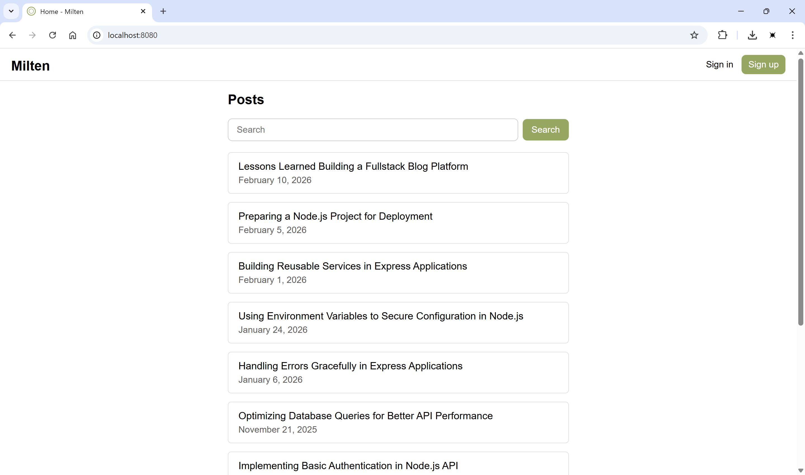

# Milten

Milten is a personal blogging platform built with **Node.js**, **Express**, **Handlebars**, and **MySQL**. This project includes both the **REST API** for managing blog content and a simple **frontend** for creating, editing, and viewing posts and comments.

## Setup Instructions

1. Clone the repository:
```
git clone https://github.com/trenter39/milten.git
cd milten
```

2. Install packages via **npm**:
```
npm install
```

3. Create database and table in **MySQL**:
```
create database milten;
```

4. Set up the database by running the `schema.sql` schema file:
```
mysql -u root -p milten < schema.sql
```

5. Configure connection to **MySQL** and **JWT** variables by creating `.env` file in the root folder. `.env` file must contain fields (example with default values):
```
PORT=8080
DB_HOST=localhost
DB_PORT=3306
DB_NAME=milten
DB_USER=root
DB_PASSWORD=password
JWT_SECRET=jwt_secret
JWT_EXPIRES_IN=1d
NODE_ENV=production
```

6. Start the server via **node**:
```
node app.js
```

Now you can visit the website via `http://localhost:8080/`.

## Docker Setup (Recommended)

For a quick out-of-the-box experience without manual database setup, run with Docker Compose:
```
docker compose up
```

